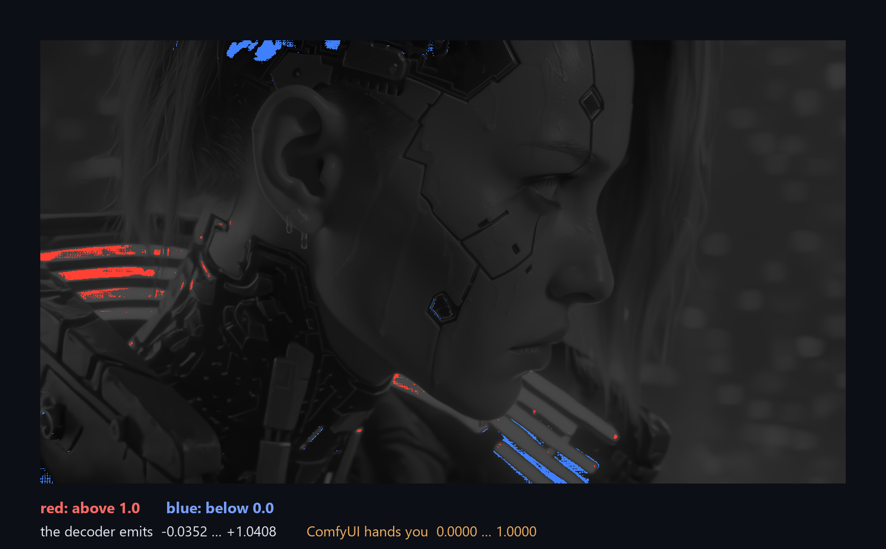
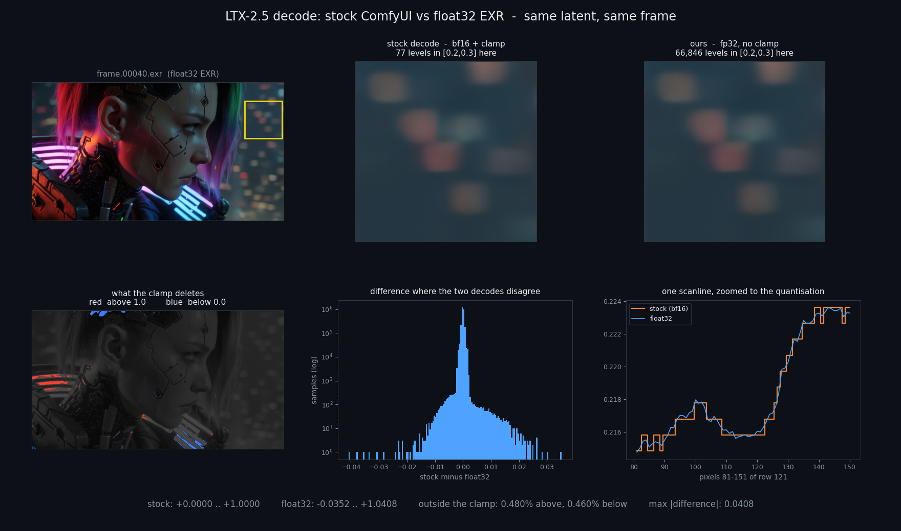
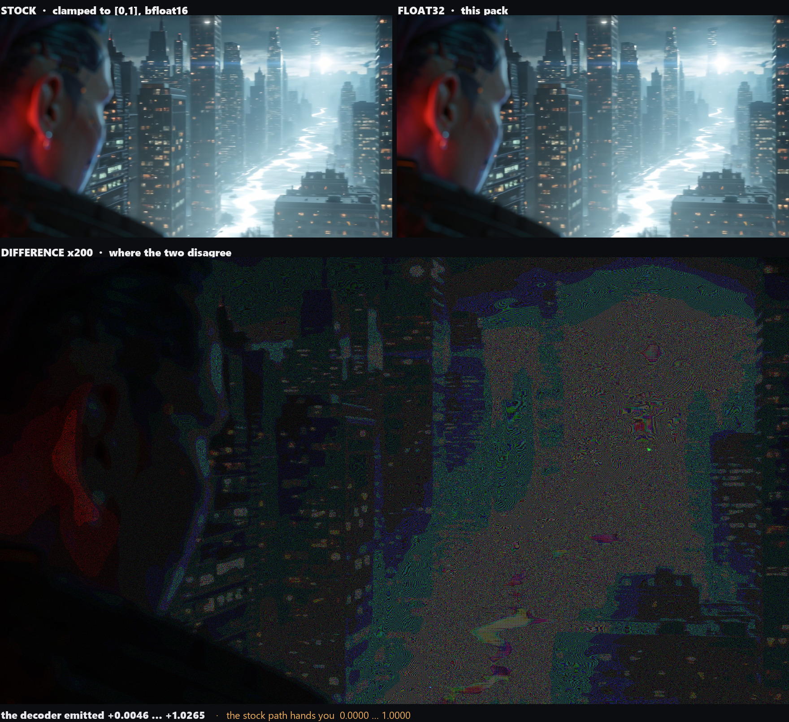
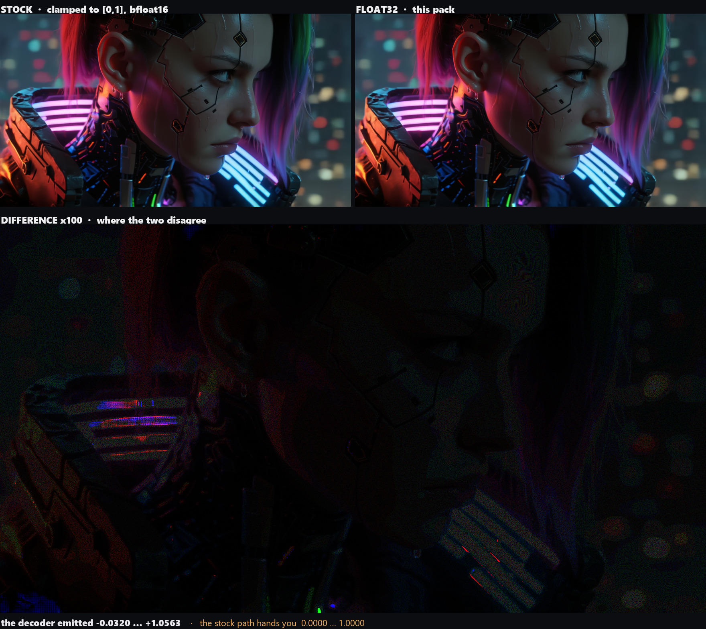
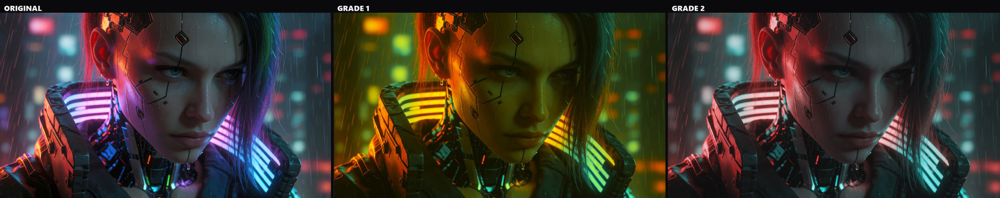

<div align="center">


# comfyui-vae-float32

**Every VAE decode in ComfyUI throws away two things, and neither is visible from inside a graph.**
<br>
**This pack gives them back - and gives you the measurements to check that on your own models.**

**By [Andromediastudio](https://andromediastudio.com/).**


</div>

---

## What is lost

### 1. Everything outside [0,1]

`comfy/sd.py:502` finishes every decode with

```python
process_output = lambda image: image.add_(1.0).div_(2.0).clamp_(0.0, 1.0)
```

Decoders routinely emit values past those bounds, and the clamp deletes whatever is out there before
any node downstream can see it. How much there is depends on the generation: across the runs measured
here the decode spanned anywhere from **−0.0196 … +1.0186** to **−0.0715 … +1.0445**, with 0.01–0.34%
of samples outside the bounds. It is the top of the speculars and the toe of the shadows — not a
hidden stop of dynamic range, but the part a grade reaches for first.

<div align="center">

</div>

On one frame of a real generation, red is what sits above 1.0 and blue what sits below 0.0:

<div align="center">

</div>

### 2. Most of the precision

Most VAEs run in bfloat16. Distinct values across `[0.2, 0.3]` of one frame:

| decode | distinct levels | smallest step |
|---|---|---|
| stock (bfloat16) | **77** | 9.77e-04 (1/1024) |
| float32 | **3 354 786** | 2.98e-08 |

bf16 and fp32 decodes of the same latent differ by up to **0.0186** — roughly five steps of an 8-bit
scale. No float32 container recovers this after the fact; the precision has to exist at decode time.

This is not LTX-specific. Same still, same probe, stock vs this pack:

| VAE | stock | ours | note |
|---|---|---|---|
| `ltx-2.5-video-vae-bf16` | 77 | 3 354 786 | |
| `ltx-2.5-video-vae-conv-bf16` | 77 | 211 974 | |
| `LTX23_video_vae_bf16` | 77 | 211 974 | |
| `ae.safetensors` (Flux) | 77 | 223 109 | |
| `qwen_image_vae` | 77 | 214 995 | |
| `wan2.2_vae` | 77 | 212 585 | |
| `wan_2.1_vae` | 77 | 215 419 | |
| `full_encoder_small_decoder` | 77 | 213 662 | |
| `hunyuanvideo15_vae_fp16` | 614 | 213 523 | fp16 starts with more mantissa than bf16 |
| `minimax_h3_video_vae_fp16` | 2 378 | 137 317 | identity `process_output`, nothing to unclamp |
| `taeltx2_3` (TAEHV) | 77 | 229 150 | identity `process_output` |

Every row comes from [`tools/measure_precision.py`](tools/measure_precision.py), which loads the VAE
outside the server and decodes the same latent twice — once the way ComfyUI does it, once without the
clamp and in float32 — so the two columns differ in nothing but the decode. Point it at your own VAE
and it prints the same two numbers for you.

**Measured on:** ComfyUI 0.32.0 · RTX 5090 32 GB · Windows 11 · PyTorch 2.12.1+cu130 · Python 3.12.11
· 126 GB RAM. One image round-tripped per VAE, plus a 121-frame 1280×704 LTX-2.5 generation for the
timing and tiling numbers. Level counts and value ranges are properties of the decode path and should
reproduce anywhere; the seconds are this machine's. Linux, macOS and other ComfyUI versions are
untested — reports welcome.

### What that actually looks like

<div align="center">

</div>

One frame, one latent, decoded twice. The two crops are the same patch of sky: they look identical,
and the level counts under them are the difference — **77** values against **66 846** in the same
band. Bottom left is what the clamp deletes, bottom middle is how far the two decodes disagree, and
bottom right is one scanline zoomed until the quantisation shows: the orange staircase is bfloat16
stepping in units of 1/1024, the blue line is the same pixels in float32. Every number on that plate
is computed by [`tools/make_decode_figure.py`](tools/make_decode_figure.py) from the EXR it renders,
so it cannot drift away from the data.

<div align="center">

</div>

One latent, decoded twice. **The two pictures are indistinguishable, and that is the point** — nothing
here looks broken, which is exactly why this goes unnoticed. The difference map, amplified ×200,
shows where the two decodes disagree: a fine grain over the sky and the haze, which is the bfloat16
grid sitting on the smooth gradients that band first under a grade, and bright specks on the light
sources, which are the highlights the clamp cut off.

<div align="center">

</div>

The same test on a neon plate, at ×100 because this frame disagrees twice as hard. Here the
disagreement sits on the light bars themselves. Neither picture is retouched: both come out of one
run, one latent, and the only difference is the decode path.

### What these plates get put through



The same LTX-2.5 frame under two heavy grades — the sort of push a plate takes when it has to match
footage shot on a camera. Every one of those moves spends the levels the decode handed over, which is
what the headroom is for.

*(Those three are ordinary 8-bit exports: they show how far the material gets pushed, not what this
pack adds. The evidence for that is [further up](#what-that-actually-looks-like). Same three
[stacked vertically](docs/assets/grade_examples_column.jpg), if that reads better.)*

---

## The ten nodes

All under the **`ANDRO`** category, all coloured alike on the canvas so it is obvious at a glance
which nodes in a graph are this pack's.

What follows is the tour. For the wiring map — what plugs into what — and the full per-widget
reference, read these:

- **[docs/NODES.md](docs/NODES.md)** — the shape of every node, which socket takes what, and the one
  wiring that is not obvious.
- **[docs/NODES_DECODE.md](docs/NODES_DECODE.md)** — `ANDRO VAE Decode` and `ANDRO VAE Encode`.
- **[docs/NODES_MEASURE.md](docs/NODES_MEASURE.md)** — `ANDRO Range Stats`, `ANDRO Compare`,
  `ANDRO Seam Check`.
- **[docs/NODES_OUTPUT.md](docs/NODES_OUTPUT.md)** — `ANDRO Remap Range`, `ANDRO Save EXR`.
- **[docs/NODES_AUDIO.md](docs/NODES_AUDIO.md)** — `ANDRO Load Audio`, `ANDRO Audio Switch`.
- **[docs/NODES_QC.md](docs/NODES_QC.md)** — `ANDRO Video QC`.

### ANDRO VAE Decode

Drop-in replacement for `VAEDecode` / `VAEDecodeTiled`. Temporarily swaps `vae.process_output` for the
same maths minus the clamp, optionally runs the decoder in float32, and restores both in `finally` —
other graphs in the session are unaffected.

It does **not** assume every VAE uses the `[-1,1] → [0,1]` default. TAEHV / lighttae (`sd.py:894, 906`),
MiniMax H3 (`976`) and StageA (`540`) already emit `[0,1]` and set identity; substituting the default
there would rescale the image and wreck it. The node probes the VAE's own transform with `-1/0/1` and
only replaces shapes it recognises — anything unfamiliar is left alone and reported.

Turn `keep_out_of_range` off to reproduce stock ComfyUI exactly.

**`tiled` is on by default** (since 1.3.0), because float32 decoding is what makes the whole-frame path
run out of VRAM in the first place — it holds the VAE at twice its usual weight and every intermediate
at four bytes a sample. This costs no visible seam, and that is measured rather than hoped for: with
the shipped defaults only the **spatial** split is active, and gradient excess at the spatial tile
boundaries comes out at **1.03–1.05×**, against the 1.30× that Seam Check needs before it will even
call something a peak. Turn it off for a single still that fits whole.

The seam everyone actually runs into is the **temporal** one, and it is a different setting: cutting
along time leaves the decoder with no context at the tile edge, so every seam gets a softer frame.
`temporal_size` therefore ships at 4096 — high enough that nothing is cut along time at all. If you
hit soft frames, the fix is to raise `temporal_size` and cut `tile_size` instead, never the reverse.

**The node also estimates whether your tile fits, on your machine.** Tile cost is a cliff rather than
a slope: while the decode fits in VRAM the size is nearly free, and the moment it stops fitting,
weights page and the same decode takes tens of times longer with no error raised. *Where* that cliff
sits depends on the card, the VAE and the frame size — 42 s against 1247 s is what it looked like on
one RTX 5090, not a universal threshold. So the node asks `vae.memory_used_decode()` (ComfyUI's own
per-VAE estimate) for one tile, compares it against free VRAM, and reports `fits` / `TIGHT` /
`WILL NOT FIT`. Full calibration table, and why it is three states rather than a yes/no, in
[docs/NODES_DECODE.md](docs/NODES_DECODE.md).

### ANDRO VAE Encode

The mirror image. Stock encode casts your pixels to the VAE's working dtype (usually bf16) before the
weights see them, so feeding it a float32 plate discards the precision at the door.

### ANDRO Range Stats

How much of a batch is outside `[0,1]`, and how finely it is quantised. Every number in this README
came from this node. It passes the image straight through, so it sits *in* a chain rather than beside
it.

The quantisation step is also reported as **effective bits** — a bf16 decode reads as 10.0, 8-bit
material as 8.0 — with a `SATURATED` warning when the distinct-value count approaches the number of
samples in the window, because past that point the step being measured belongs to the picture rather
than to the format.

It also answers the question the pretty pictures could not: **where would banding actually show up.**
A band is one quantisation level held across several pixels, so risk needs a real gradient *and* local
noise below the step — noisy material dithers itself and never bands. That comes out as a percentage
and a `banding_mask`, plus a log-scaled `histogram` with the clamp limits marked. Validation table
against six known-answer cases: [docs/NODES_MEASURE.md](docs/NODES_MEASURE.md).

### ANDRO Compare

Two batches in, metrics out: max and mean absolute difference, percentage of differing samples, PSNR,
SSIM, the worst five frames — plus an amplified difference image. For answering "did that setting
change anything, and is the change real" without exporting and diffing by hand.

**A global number cannot tell "spread thinly over the frame" from "all of it in one patch of sky",
and only the second is worth acting on.** So the worst frame is split into an 8×8 grid and the hottest
tile is named with its concentration factor. Measured on damage confined to one corner: PSNR 46.4 dB,
which reads as fine, while the node reports the hottest zone at **17.3× the frame average** and says
outright that the global figure is diluted. The report ends with a verdict — bit-identical, below a
12-bit step, small and evenly spread, or structural and localised and worth the float32 decode.

### ANDRO Seam Check

Tiled decoding leaves artefacts, and the temporal kind is easy to miss. A diffusion decoder has no
context at a temporal tile edge, so the blend leaves a visibly **softer frame on every seam** — smooth,
not a jump, which is exactly why a frame-to-frame difference check does not see it.

This node measures per-frame sharpness, finds local dips, and reports only when several of them sit on
one regular grid — motion in the shot produces isolated soft frames too. Real output from a bad setting:

```
temporal: 121 frame(s), median sharpness 0.00738
  soft frames at [12, 25, 49, 66, 73, 97]
  PERIODIC: 4 of them every 24 frames ([25, 49, 73, 97]) - that is a temporal tiling seam.
  off-grid, most likely motion in the shot: [12, 66]
```

Same generation, temporal tiling off: `soft frames at [66] - no regular spacing, these look like
content`. It also checks for spatial seams, again requiring regularity rather than a single strong
column, because a hard edge in the content looks identical to one.

**It also predicts seams before the decode.** The spacing is arithmetic, not luck: `tile_t =
temporal_size / temporal_compression`, and a seam lands every `(tile_t - overlap_t) × compression`
frames. Hand it the settings and it says where the soft frames must fall, then confronts that with
what it measured:

```
prediction: tile_t=4 latent frames, overlap_t=1 -> a soft frame every 24 output frames,
            i.e. at [25, 49, 73, 97, 121]
  ...
  CONFIRMED: 4 of 5 predicted seam frames actually went soft - the temporal tiling is the cause
```

A prediction with nothing measured is reported as such — either the blend is gentler than the
threshold, or the compression figure is wrong for that VAE. It does not quietly conclude "no seam".

### ANDRO Remap Range

An 8/10-bit writer clips whatever sits above 1.0. When that matters, map it down deliberately —
`filmic rolloff` (default), `clip`, `scale to fit`, `reinhard highlights`, or `report only`.

The default exists because the obvious option is a bad trade. Overshoot is 0.01–0.34% of samples, and
`scale to fit` pays for those few by moving **every** sample, flattening parts of the picture that
were correctly exposed. `filmic rolloff` leaves everything below the knee bit-exact — verified,
maximum change there is `0.0` — and bends only the top, mapping the input peak to exactly 1.0. On one
plate that is 11.2% of samples moved against 100%, with the mid-tone untouched in the first case and
shifted in the second.

Either way the report gives the price in stops and names what it cost, including for `clip`, where it
says how much is now unrecoverable and that this is identical to stock ComfyUI.

> **On 10-bit output.** ComfyUI's `CreateVideo` has a `bit_depth` widget, and it does work — set it to
> 10 and the file comes out `yuv420p10le`, High 10 profile, carrying 851 distinct luma values against
> the 256 an 8-bit file can physically hold. But a container creates nothing: fed the stock bf16
> decode, those 10 bits faithfully record the same 77 levels. The two are complementary — this pack
> fixes *what goes in*, `bit_depth` fixes *what it goes into*. (Note also that 10-bit output is still
> written untagged: `color_primaries/transfer/space = unknown`. That one needs a colour-managed
> writer.)

### ANDRO Save EXR

Writes an EXR sequence through the **OpenEXR module**, not cv2, and verifies the file landed rather
than trusting the writer.

> OpenCV compiles the EXR codec in but leaves it **disabled** unless `OPENCV_IO_ENABLE_OPENEXR=1` is
> set before `cv2` is imported ([opencv#21326](https://github.com/opencv/opencv/issues/21326)). No
> ComfyUI launcher sets it, so any node writing EXR through `cv2.imwrite` silently produces nothing.
> If your pack does that, it is worth checking — this one bit ComfyUI-OCIO too
> ([fix](https://github.com/SlavaSexton/ComfyUI-OCIO/pull/5)).

**The file records how its own pixels were made.** The header carries `andro/*` attributes — measured
range, how much sat outside `[0,1]`, bit depth, frame count — and wiring `ANDRO VAE Decode`'s
`range_report` into the `decode_report` input stores the decode's own account verbatim, dtypes
included. Six months later the file still answers "was this the float32 pass?" on its own. This does
not overlap OCIO, whose metadata describes the plate: camera, lens, timecode.

**The header also says what colour the numbers are.** An untagged EXR is read as linear by every
compositor that opens it, and for a decoded SDR frame that is simply wrong: what a VAE hands back is
**display-referred sRGB/Rec.709 gamma**, which is why `colorspace` defaults to `srgb_display`. Two
exceptions worth knowing: LTX-2.5 HDR decodes are **ACEScct**, and the LTX-2.3 HDR IC-LoRA is
**LogC3**. The choice writes `andro/colorspace`, `andro/transfer`, `andro/primaries` and — for every
known gamut — the standard OpenEXR `chromaticities` attribute, so a reader can act on it rather than
guess. `colorspace_note` appends free text ("Flux.2 decode", "after OCIO ColorSpace to ACEScg").

This is a **label, not a conversion**: not one pixel is touched. Nuke, Resolve and anything else
reading the sequence must be told the same colourspace on input — the file is not linearised on the
way out, it is only finally honest about what it holds.

Optionally the sequence gets a second layer, `clipped`, holding **exactly what the stock clamp would
have deleted** and zero everywhere it would have kept the value — verified by reading the written
files back. The loss then travels inside the file rather than in a screenshot someone has to be shown.
Readers that ignore extra layers are unaffected.

**Frames are numbered the way your pipeline numbers them.** `start_frame` and `padding` decide the
number in `stem.NNNNN.exr`; their defaults, 1 and 5, are exactly the historic `frame.00001.exr`, so
an existing graph writes the same names it always did. Set `start_frame` to 1001 and `padding` to 4
and the same batch lands as `frame.1001.exr`, `frame.1002.exr` — the convention Nuke, Resolve and
every conform tool expect, without renaming a sequence after the fact. A number too large for its
padding is written in full rather than truncated, because truncating would collide two frames onto
one filename; the report says so when it happens, and names the first and last file either way.

**The frame can also carry the graph that made it.** With `write_metadata` on, the header gains the
run's identity — `andro/created` with its UTC offset, `andro/comfyVersion`, `andro/packVersion`,
and your own `shot_info` (the host name goes only into the sidecar manifest, never into a frame that may travel to a client) — plus a summary read straight out of the API graph ComfyUI
hands the node: every checkpoint, VAE, CLIP and LoRA filename (`andro/models`), every seed with the
node that used it (`andro/seeds`), the text prompts (`andro/prompts`), the full settings of any
API-generator node — Runway, Seedance, Kling, Veo, Luma, Sora and friends — whose parameters exist
nowhere else on disk (`andro/apiNodes`), and `andro/workflowHash`, a sha256 of the canonicalised API
graph, so two frames from the same graph hash alike no matter how the canvas was rearranged. With
`embed_workflow` on, the whole workflow and prompt go in verbatim as well: a ~100 KB graph was
written into a header attribute and read back intact. Turn `embed_workflow` **off for confidential
graphs** — the summary fields, the hash included, are still written. Alongside the sequence the node
drops `<stem>.manifest.json` holding the same facts structured rather than joined into strings, which
is what a script reads without an EXR library, and what survives a transcode that discards custom
attributes.

### ANDRO Load Audio

Stock `LoadAudio` refuses a filename that is not in the input folder, and ComfyUI validates **every**
node in a prompt before any of it runs. So a graph that merely *contains* an audio branch cannot run
without that file — even when a switch downstream was never going to use it. Marking the input lazy
does not help either; measured on 0.32.0, a lazy branch is still validated:

```
{"switch": false, "on_true": [LoadAudio "no_such_file.wav"], ...}
  -> HTTP 400  Prompt outputs failed validation
     audio - Invalid audio file: no_such_file.wav
```

That single behaviour is what forces the mute-the-whole-chain ritual, and why forgetting one node in
the chain breaks the run. This node owns its validation instead: an unknown file becomes
`silence_seconds` of silence and a line in the `report` output. Same file picker, same decoder as
stock (`comfy_extras.nodes_audio.load`), plus `path_override` for audio outside the input folder.

```
loaded 'your_take.wav': 5.00s, 48000 Hz, 2ch
'no_such_file.wav' not found - 5s of silence instead. Nothing failed; ...
```

Duration, rate and channel count are always stated, because audio length frequently decides clip
length and that is otherwise learned only after the run. A rate that differs from `sample_rate` is
named either way, and `resample_to_sample_rate` converts it — 44100 → 48000 Hz turns 220500 samples
into 240000 with the duration unchanged — rather than letting the mismatch surface as a confusing
failure much further down the graph.

### ANDRO Audio Switch

`generated_audio`, `external_audio`, and one `audio_source` toggle reading **generated | external**.
That toggle is the whole mechanic — nothing needs muting, deleting or re-wiring to change your mind.

| state | result |
|---|---|
| both connected | `audio_source` decides, and **only that branch is computed** |
| one branch muted, bypassed or deleted | the survivor is used, whatever the toggle says |
| neither connected | a plain sentence naming both inputs, not `missing a required input` |

Both latent inputs are optional *and* lazy. Optional, so disabling either side is legal — 1.0.0
required `generated`, so turning *that* side off failed in a way that read like a broken node. Lazy,
so the branch you did not pick is never executed: with `audio_source` on `generated`, the wav is not
even decoded.

Written for LTX's audio branch, where `LTXVConcatAVLatent` demands an audio latent, but it works
anywhere an input is mandatory and you want it to be skippable.

### ANDRO Video QC

The one node here that is not about a VAE. Everything else in this pack asks *what did our decode
do*; this one asks **what did the file someone sent us actually contain** — the check a pipeline TD
runs before a plate is accepted.

Point it at a clip out of Runway, Seedance or Kling and it reports effective bit depth and which
quantisation grid the values sit on, the share outside `[0,1]` and any NaN, black frames, flashes,
flicker, duplicate and **held** frames, resolution / frame count / fps against what was ordered,
and — with `source_path` set, via `ffprobe` — codec, pixel format and the container's colour tags.
One verdict (`PASS` / `WARN` / `FAIL`), a `pass:BOOLEAN` to gate a branch on, and a **contact sheet
of the flagged frames, each labelled with its number and reason**, because half of what it flags is
a judgement call that only looks settled once you see the frames.

Two findings from the two real clips it was built against, both 24 fps h264:

```
WARN: untagged colour (space, transfer, primaries): readers will assume BT.601 / unknown transfer
WARN: 81 held frame(s) = 22.4% of the clip
  held (81): 7, 11, 15, 19, 23, 27, 59, 63, 67, 71, 75, 79, 83, 87, 91, 95, ...
```

**Untagged on all three colour fields** — the normal state of AI-generated video, and the most
expensive item on the list, because the grade then starts from the wrong primaries and nothing
errors. And a **period-4 held pattern**: roughly one frame in four barely moves, so a 24 fps file is
carrying about 6 fps of motion. It conforms, it plays, and it judders on the first pan.

One caveat the node prints for itself rather than letting you fall into: a `yuv420p` file reaches an
`IMAGE` batch through a YUV → RGB matrix, which lands 8-bit values on a much finer grid — both clips
measure ~50–60 k levels per channel on `k/65535`. When the container states a depth, the container
wins, and the level count is describing the decode path. Full reference:
**[docs/NODES_QC.md](docs/NODES_QC.md)**.

---

## Settings that matter

**Tile space, never time.** Measured on a 121-frame 1280×704 clip, fp32 decode, RTX 5090:

| tile_size | temporal_size | wall clock | result |
|---|---|---|---|
| 768 | 4096 | **912 s** | exceeds 32 GB VRAM → dynamic-VRAM offload, crawls |
| 768 | 32 | 60 s | ⚠️ soft frame every 24 frames |
| **384** | **4096** | **60 s** | clean |

The 24-frame period is arithmetic: `tile_t = 32/8 = 4` latent frames, `overlap_t = 1`, so the step is
`3` latent = 24 pixel frames. Cutting the **spatial** tile is what actually solves the memory wall, and
it costs nothing: gradient excess at the spatial tile boundaries measures 1.03–1.05×, i.e. no seam.

**float32 costs about 3× the decode time and 2× the VAE's VRAM.** On the clip above that was still
60 s, because the spatial tile was the real constraint.

### tile_size is free in bf16 and a cliff in fp32

Decode only, no sampler: an empty `1280×704×121` latent through the LTX-2.5 video VAE, `temporal_size
4096`, `overlap 64`, RTX 5090 32 GB. Script: [`tools/bench_tiling.py`](tools/bench_tiling.py).

| precision | tile_size | decode | |
|---|---|---|---|
| bf16 | 384 | 12.1 s | |
| bf16 | 768 | 12.1 s | ComfyUI's official LTX-2.5 template |
| float32 | 384 | 44.2 s | this pack's default |
| float32 | 512 | 42.4 s | stock `VAEDecodeTiled` default |
| float32 | 768 | **1247 s** | **28× slower** |

In bf16 the tile size costs nothing — 384 and 768 are identical. In float32 it is a cliff: 384 and 512
sit within noise of each other, and 768 no longer fits, so the loader starts paging weights and a
12-second decode becomes 21 minutes. No error, no warning, just a progress bar that stops moving.

**Resolution scales linearly; the tile is what sets the ceiling.** The same 121 frames at 1920×1088 in
float32: **109.1 s** at `tile_size 384`, **100.8 s** at 512 — 2.32× the pixels of the runs above, ~2.4×
the time, and VRAM never moved in either. The cliff did not move down with the bigger frame, and 512
stays marginally faster than 384 at both resolutions (fewer tiles, less overlap recomputed). Cutting
the tile buys headroom that the frame size then spends linearly, which is the whole reason to reach
for `tile_size` rather than `temporal_size`. (768 at 1920×1088 was not measured — the 1280×704 run
already took 21 minutes.)

> `EmptyLTXVLatentVideo` and the LTX latent grid floor-divide by 32, so **1080 is not a valid height** —
> it silently becomes 1056. Use 1088 (or 1056) and know which one you picked.

**This is the trap worth knowing about.** ComfyUI's own template
`video_ltx2_5_i2v.json` ships `VAEDecodeTiled` at **768 / 64 / 4096 / 32**, and that is a sensible
choice — for bf16, where it is free. Swap in this pack's float32 decode, leave 768 in place, and the
same graph takes twenty minutes. Halve the tile.

(The template also sets `temporal_size` to 4096, i.e. temporal tiling effectively off — Comfy's own
template agrees with the rule above, even though the node's default of 64 does not. At 64 the tile is
8 latent frames with 1 of overlap, so a soft frame lands every 56 output frames.)

---

## Start here

**[`example_workflows/01_measure_your_vae.json`](example_workflows/01_measure_your_vae.json)** —
drop it in, point `VAELoader` at any VAE you already have, hit Run. It round-trips one image through
that VAE and decodes the latent twice, stock and float32, side by side:

<div align="center">

</div>

The two Range Stats readouts are the whole point: same latent, same VAE, and one of them has a few
hundred thousand more levels than the other. No LTX, no video model, nothing to download.

Copy `example_workflows/neon_cyborg_portrait.png` into your `ComfyUI/input/` folder first, or point
`LoadImage` at anything you already have; the shipped `VAELoader` value is `qwen_image_vae.safetensors`,
swap it for a VAE you own. Verified run, exactly as the file ships:

```
ours  - float32, no clamp: min=-0.019557 max=+1.018609   506 744 levels in [0.2,0.3]
stock - ComfyUI decode:    min=+0.000000 max=+1.000000        77 levels
Compare: max |diff| = 0.151855, PSNR 58.14 dB
```

### The full pipeline

**[`example_workflows/LTX2.5_float32_EXR.json`](example_workflows/LTX2.5_float32_EXR.json)** — 64
nodes, image to video on LTX-2.5, the whole thing wrapped in one subgraph so the controls sit on its
face instead of somewhere inside. Start image in, and out the other end come a float32 EXR sequence,
a video, and the range report for the decode that produced them.

It wants these in your model folders:

| slot | file |
|---|---|
| `UNETLoader` | `ltx-2.5-22b-distilled-transformer-comfy-int8-convrot` |
| `VAELoader` ×2 | `ltx-2.5-video-vae-bf16`, `ltx-2.5-audio-vae-bf16` |
| `CLIPLoader` ×2 | `gemma4-12b-with-proj-ltx-2.5-comfy-int8-convrot`, `gemma4_e2b_it_bf16` |
| `LatentUpscaleModelLoader` | `ltx-2.5-latent-spatial-upscaler-x2-bf16-1.0` |

The knobs that matter, all promoted onto the subgraph node:

- **`precision`** `float32` and **`keep_out_of_range`** on — the two the pack exists for. Flip either
  back to reproduce stock ComfyUI exactly.
- **`audio_source`** — `generated` lets the model write the audio, `external` takes the file in
  `audio_file`. One toggle; nothing needs muting either way.
- **`filename_prefix`** and **`exr_half_float`** — where the sequence lands and whether it is 32f
  or 16f. 121 frames of 1280×704 float32 EXR is about 1.2 GB, so give it a folder of its own.
- Resolution comes from the **`ResolutionSelector`** outside the subgraph, in megapixels: 0.9 gives
  1280×704, 2.1 gives 1920×1088. Editing the width and height fields does nothing, they are driven.
- Inside, `ANDRO VAE Decode` is tiled at `tile_size 384` with `temporal_size 4096`. Leave it there
  unless you have read the tiling table above.

**What it needs from you.** The start image: `LoadImage` is stock, and stock means a filename that is
not in your `input/` folder fails the whole prompt before anything runs, so copy the png across or
point the node at your own. The audio is the opposite — `your_take.wav` is not on your disk and does
not need to be. `ANDRO Load Audio` turns a missing file into silence and says so in its report,
and on `generated` the file is not read at all.

`01_measure_your_vae_API.json` is the same starter graph flattened for the `/prompt` endpoint, for
driving it from a script.

## Install

**ComfyUI-Manager**: search for `comfyui-vae-float32` and install, then restart. The pack is published
on the [Comfy Registry](https://registry.comfy.org/) under publisher `andreiorehov`.

**By hand**: clone into `ComfyUI/custom_nodes/` and restart.

Either way, `pip install OpenEXR` if you want EXR output; the pack falls back to 32-bit float TIFF
otherwise, which carries the same values under a different extension.

Upgrading from 1.2.x is safe: every node was renamed in 1.3.0, but the old keys stay registered and a
graph saved earlier is migrated to the new names as it loads. Save the workflow once and it is
permanent. See [CHANGELOG.md](CHANGELOG.md).

## Requirements

`OpenEXR>=3.3`, `tifffile`, `numpy`. Everything else comes with ComfyUI.

## Known rough edges

**A measuring node that reports nothing probably never ran.** ComfyUI's selection toolbox — the strip
that appears when you select nodes on the canvas — has a ▶ button, and it does not mean Run. It runs
`Comfy.QueueSelectedOutputNodes`, which sends `partial_execution_targets`; the executor then keeps
only those output nodes and drops every other one (`execution.py`, `partial_execution_list`).
Measured here with `PreviewImage` selected: `outputs_to_execute` came back as `['9']`, and both
`ANDRO Range Stats` nodes and `ANDRO Save EXR` never executed. The run still reported **success**,
with no message saying anything had been skipped.

A plain Run queues every output node — verified on the same install: `outputs_to_execute:
['4','6','7','8']`, all four reported, and the EXR files landed. This is stock ComfyUI behaviour and
a stock `SaveImage` is dropped exactly the same way, but from the outside it looks precisely like a
broken node, so it is worth knowing before filing an issue.

**MiniMax H3, once.** In one batch run the decode died with
`ValueError: Buffer too small: needs 196608 bytes, but only has 102400`. That VAE is the only one
tested here that uses ComfyUI's chunked-IO path with a pre-allocated output buffer
(`comfy/sd.py:1201`), so the fp32 cast is the obvious suspect. It did not reproduce: three subsequent
runs of the same graph, and separate runs at `vae default` and `float32`, all succeeded. Cause not
established. If you hit it, `precision: vae default` avoids the cast entirely — and please open an
issue with the model and frame count.

**Timings are from one machine** (RTX 5090, Windows, ComfyUI 0.32.0, PyTorch 2.12.1+cu130). Level
counts and value ranges are properties of the decode path and should reproduce anywhere; seconds are
not.

**Not yet tested:** Linux, macOS, ComfyUI versions other than 0.32.0, and a clean install where
`OpenEXR` is not already present.

## A caveat worth stating

This pack reaches into `vae.process_output`, `vae.vae_dtype` and `first_stage_model` — none of which
are public API. A ComfyUI refactor can break it. The `-1/0/1` probe and the guarded fp32 cast are there
so that a surprise degrades into "no change, with a note in the report" rather than a corrupted image,
but if something looks wrong, compare against stock with **ANDRO Compare** first.

## Licence and credit

**Apache-2.0** (see [LICENSE](LICENSE)), copyright 2026 Andrei Orehov / Andromediastudio.

Use the nodes in whatever you like, commercial work included, and owe nothing for it. Credit is
welcome but not required: *VAE float32 nodes by Andrei Orehov (Andromediastudio)*.

Redistributing the code is where the licence asks something back. Section 4(d) requires the
[NOTICE](NOTICE) file to travel with any copy or derivative, so a fork, a repackaged pack or a bundle
keeps the authorship visible. Every source file carries an SPDX header saying the same thing, because
files get copied one at a time.

Commits made before the first release carried an MIT header; the release and everything after it are
Apache-2.0.
