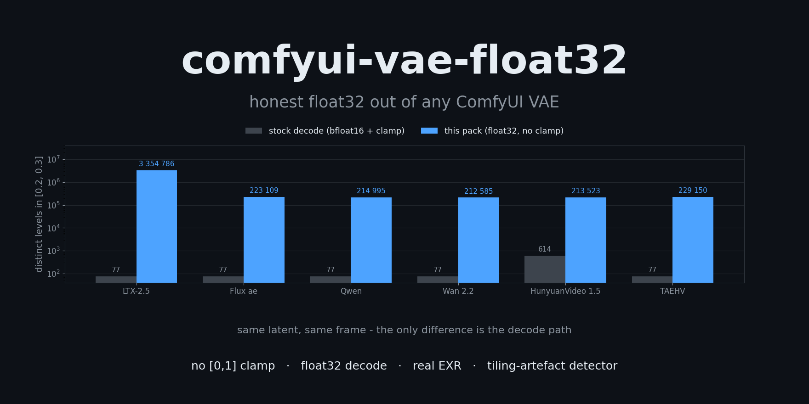
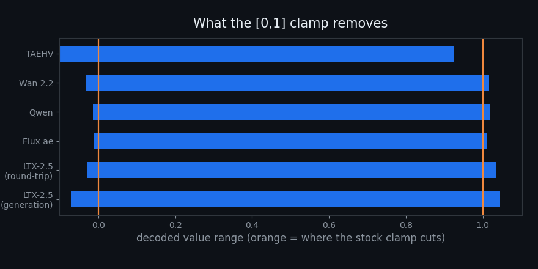
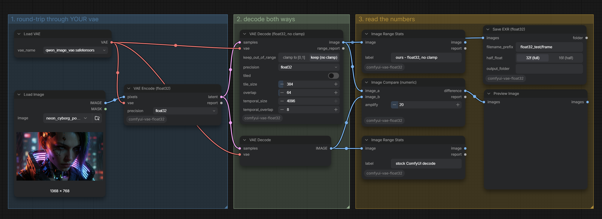
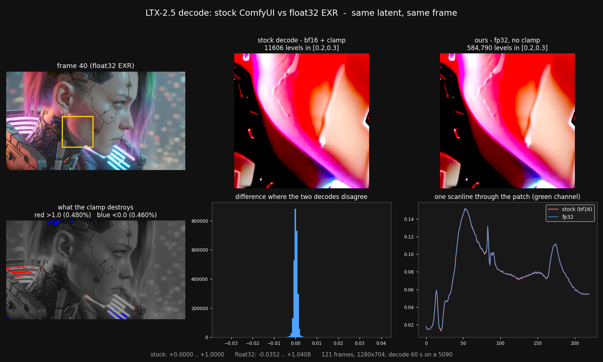

<div align="center">



# comfyui-vae-float32

**Every VAE decode in ComfyUI throws away two things, and neither is visible from inside a graph.**
<br>
**This pack gives them back - and gives you the measurements to check that on your own models.**

**By [Andromediastudio](https://andromediastudio.com/).**


</div>

---

## What is lost

### 1. Everything outside [0,1]

`comfy/sd.py:502` finishes every decode with

```python
process_output = lambda image: image.add_(1.0).div_(2.0).clamp_(0.0, 1.0)
```

Decoders routinely emit values past those bounds. On a real LTX-2.5 generation the decode spans
**−0.0715 … +1.0445**: specular highlights and shadow detail, deleted before any node downstream can
see them.

<div align="center">

</div>

### 2. Most of the precision

Most VAEs run in bfloat16. Distinct values across `[0.2, 0.3]` of one frame:

| decode | distinct levels | smallest step |
|---|---|---|
| stock (bfloat16) | **77** | 9.77e-04 (1/1024) |
| float32 | **3 354 786** | 2.98e-08 |

bf16 and fp32 decodes of the same latent differ by up to **0.0186** — roughly five steps of an 8-bit
scale. No float32 container recovers this after the fact; the precision has to exist at decode time.

This is not LTX-specific. Same still, same probe, stock vs this pack:

| VAE | stock | ours | note |
|---|---|---|---|
| `ltx-2.5-video-vae-bf16` | 77 | 3 354 786 | |
| `ltx-2.5-video-vae-conv-bf16` | 77 | 211 974 | |
| `LTX23_video_vae_bf16` | 77 | 211 974 | |
| `ae.safetensors` (Flux) | 77 | 223 109 | |
| `qwen_image_vae` | 77 | 214 995 | |
| `wan2.2_vae` | 77 | 212 585 | |
| `wan_2.1_vae` | 77 | 215 419 | |
| `full_encoder_small_decoder` | 77 | 213 662 | |
| `hunyuanvideo15_vae_fp16` | 614 | 213 523 | fp16 starts with more mantissa than bf16 |
| `minimax_h3_video_vae_fp16` | 2 378 | 137 317 | identity `process_output`, nothing to unclamp |
| `taeltx2_3` (TAEHV) | 77 | 229 150 | identity `process_output` |

**Measured on:** ComfyUI 0.32.0 · RTX 5090 32 GB · Windows 11 · PyTorch 2.12.1+cu130 · Python 3.12.11
· 126 GB RAM. One image round-tripped per VAE, plus a 121-frame 1280×704 LTX-2.5 generation for the
timing and tiling numbers. Level counts and value ranges are properties of the decode path and should
reproduce anywhere; the seconds are this machine's. Linux, macOS and other ComfyUI versions are
untested — reports welcome.

---

## The nodes

All under the **`vae_float32`** category.

### VAE Decode (float32, no clamp)

Drop-in replacement for `VAEDecode` / `VAEDecodeTiled`. Temporarily swaps `vae.process_output` for the
same maths minus the clamp, optionally runs the decoder in float32, and restores both in `finally` —
other graphs in the session are unaffected.

It does **not** assume every VAE uses the `[-1,1] → [0,1]` default. TAEHV / lighttae (`sd.py:894, 906`),
MiniMax H3 (`976`) and StageA (`540`) already emit `[0,1]` and set identity; substituting the default
there would rescale the image and wreck it. The node probes the VAE's own transform with `-1/0/1` and
only replaces shapes it recognises — anything unfamiliar is left alone and reported.

Turn `keep_out_of_range` off to reproduce stock ComfyUI exactly.

### VAE Encode (float32)

The mirror image. Stock encode casts your pixels to the VAE's working dtype (usually bf16) before the
weights see them, so feeding it a float32 plate discards the precision at the door.

### Image Range Stats

How much of a batch is outside `[0,1]`, and how finely it is quantised. Every number in this README
came from this node.

### Image Compare (numeric)

Two batches in, metrics out: max and mean absolute difference, percentage of differing samples, PSNR,
which frame deviates most — plus an amplified difference image. For answering "did that setting change
anything, and is the change real" without exporting and diffing by hand.

### Tile Seam Check

Tiled decoding leaves artefacts, and the temporal kind is easy to miss. A diffusion decoder has no
context at a temporal tile edge, so the blend leaves a visibly **softer frame on every seam** — smooth,
not a jump, which is exactly why a frame-to-frame difference check does not see it.

This node measures per-frame sharpness, finds local dips, and reports only when several of them sit on
one regular grid — motion in the shot produces isolated soft frames too. Real output from a bad setting:

```
temporal: 121 frame(s), median sharpness 0.00738
  soft frames at [12, 25, 49, 66, 73, 97]
  PERIODIC: 4 of them every 24 frames ([25, 49, 73, 97]) - that is a temporal tiling seam.
  off-grid, most likely motion in the shot: [12, 66]
```

Same generation, temporal tiling off: `soft frames at [66] - no regular spacing, these look like
content`. It also checks for spatial seams, again requiring regularity rather than a single strong
column, because a hard edge in the content looks identical to one.

### Remap Range

An 8/10-bit writer clips whatever sits above 1.0. When that matters, map it down deliberately —
`clip`, `scale to fit`, `reinhard highlights`, or `report only`.

> **On 10-bit output.** ComfyUI's `CreateVideo` has a `bit_depth` widget, and it does work — set it to
> 10 and the file comes out `yuv420p10le`, High 10 profile, carrying 851 distinct luma values against
> the 256 an 8-bit file can physically hold. But a container creates nothing: fed the stock bf16
> decode, those 10 bits faithfully record the same 77 levels. The two are complementary — this pack
> fixes *what goes in*, `bit_depth` fixes *what it goes into*. (Note also that 10-bit output is still
> written untagged: `color_primaries/transfer/space = unknown`. That one needs a colour-managed
> writer.)

### Save EXR (float32)

Writes an EXR sequence through the **OpenEXR module**, not cv2, and verifies the file landed rather
than trusting the writer.

> OpenCV compiles the EXR codec in but leaves it **disabled** unless `OPENCV_IO_ENABLE_OPENEXR=1` is
> set before `cv2` is imported ([opencv#21326](https://github.com/opencv/opencv/issues/21326)). No
> ComfyUI launcher sets it, so any node writing EXR through `cv2.imwrite` silently produces nothing.
> If your pack does that, it is worth checking — this one bit ComfyUI-OCIO too
> ([fix](https://github.com/SlavaSexton/ComfyUI-OCIO/pull/5)).

### Load Audio (optional)

Stock `LoadAudio` refuses a filename that is not in the input folder, and ComfyUI validates **every**
node in a prompt before any of it runs. So a graph that merely *contains* an audio branch cannot run
without that file — even when a switch downstream was never going to use it. Marking the input lazy
does not help either; measured on 0.32.0, a lazy branch is still validated:

```
{"switch": false, "on_true": [LoadAudio "no_such_file.wav"], ...}
  -> HTTP 400  Prompt outputs failed validation
     audio - Invalid audio file: no_such_file.wav
```

That single behaviour is what forces the mute-the-whole-chain ritual, and why forgetting one node in
the chain breaks the run. This node owns its validation instead: an unknown file becomes
`silence_seconds` of silence and a line in the `report` output. Same file picker, same decoder as
stock (`comfy_extras.nodes_audio.load`), plus `path_override` for audio outside the input folder.

```
loaded 'riff_meat_5s.wav': 5.00s, 48000 Hz, 2ch
'no_such_file.wav' not found - 5s of silence instead. Nothing failed; ...
```

### Audio Latent Switch (generated / external)

`generated_audio`, `external_audio`, and one `audio_source` toggle reading **generated | external**.
That toggle is the whole mechanic — nothing needs muting, deleting or re-wiring to change your mind.

| state | result |
|---|---|
| both connected | `audio_source` decides, and **only that branch is computed** |
| one branch muted, bypassed or deleted | the survivor is used, whatever the toggle says |
| neither connected | a plain sentence naming both inputs, not `missing a required input` |

Both latent inputs are optional *and* lazy. Optional, so disabling either side is legal — 1.0.0
required `generated`, so turning *that* side off failed in a way that read like a broken node. Lazy,
so the branch you did not pick is never executed: with `audio_source` on `generated`, the wav is not
even decoded.

Written for LTX's audio branch, where `LTXVConcatAVLatent` demands an audio latent, but it works
anywhere an input is mandatory and you want it to be skippable.

---

## Settings that matter

**Tile space, never time.** Measured on a 121-frame 1280×704 clip, fp32 decode, RTX 5090:

| tile_size | temporal_size | wall clock | result |
|---|---|---|---|
| 768 | 4096 | **912 s** | exceeds 32 GB VRAM → dynamic-VRAM offload, crawls |
| 768 | 32 | 60 s | ⚠️ soft frame every 24 frames |
| **384** | **4096** | **60 s** | clean |

The 24-frame period is arithmetic: `tile_t = 32/8 = 4` latent frames, `overlap_t = 1`, so the step is
`3` latent = 24 pixel frames. Cutting the **spatial** tile is what actually solves the memory wall, and
it costs nothing: gradient excess at the spatial tile boundaries measures 1.03–1.05×, i.e. no seam.

**float32 costs about 3× the decode time and 2× the VAE's VRAM.** On the clip above that was still
60 s, because the spatial tile was the real constraint.

### tile_size is free in bf16 and a cliff in fp32

Decode only, no sampler: an empty `1280×704×121` latent through the LTX-2.5 video VAE, `temporal_size
4096`, `overlap 64`, RTX 5090 32 GB. Script: [`tools/bench_tiling.py`](tools/bench_tiling.py).

| precision | tile_size | decode | |
|---|---|---|---|
| bf16 | 384 | 12.1 s | |
| bf16 | 768 | 12.1 s | ComfyUI's official LTX-2.5 template |
| float32 | 384 | 44.2 s | this pack's default |
| float32 | 512 | 42.4 s | stock `VAEDecodeTiled` default |
| float32 | 768 | **1247 s** | **28× slower** |

In bf16 the tile size costs nothing — 384 and 768 are identical. In float32 it is a cliff: 384 and 512
sit within noise of each other, and 768 no longer fits, so the loader starts paging weights and a
12-second decode becomes 21 minutes. No error, no warning, just a progress bar that stops moving.

**Resolution scales linearly; the tile is what sets the ceiling.** The same 121 frames at 1920×1088 in
float32: **109.1 s** at `tile_size 384`, **100.8 s** at 512 — 2.32× the pixels of the runs above, ~2.4×
the time, and VRAM never moved in either. The cliff did not move down with the bigger frame, and 512
stays marginally faster than 384 at both resolutions (fewer tiles, less overlap recomputed). Cutting
the tile buys headroom that the frame size then spends linearly, which is the whole reason to reach
for `tile_size` rather than `temporal_size`. (768 at 1920×1088 was not measured — the 1280×704 run
already took 21 minutes.)

> `EmptyLTXVLatentVideo` and the LTX latent grid floor-divide by 32, so **1080 is not a valid height** —
> it silently becomes 1056. Use 1088 (or 1056) and know which one you picked.

**This is the trap worth knowing about.** ComfyUI's own template
`video_ltx2_5_i2v.json` ships `VAEDecodeTiled` at **768 / 64 / 4096 / 32**, and that is a sensible
choice — for bf16, where it is free. Swap in this pack's float32 decode, leave 768 in place, and the
same graph takes twenty minutes. Halve the tile.

(The template also sets `temporal_size` to 4096, i.e. temporal tiling effectively off — Comfy's own
template agrees with the rule above, even though the node's default of 64 does not. At 64 the tile is
8 latent frames with 1 of overlap, so a soft frame lands every 56 output frames.)

---

## Start here

**[`example_workflows/01_measure_your_vae.json`](example_workflows/01_measure_your_vae.json)** —
drop it in, point `VAELoader` at any VAE you already have, hit Run. It round-trips one image through
that VAE and decodes the latent twice, stock and float32, side by side:

<div align="center">

</div>

The two Range Stats readouts are the whole point: same latent, same VAE, and one of them has a few
hundred thousand more levels than the other. No LTX, no video model, nothing to download.

Copy `example_workflows/neon_cyborg_portrait.png` into your `ComfyUI/input/` folder first, or point
`LoadImage` at anything you already have; the shipped `VAELoader` value is `qwen_image_vae.safetensors`,
swap it for a VAE you own. Verified run, exactly as the file ships:

```
ours  - float32, no clamp: min=-0.019557 max=+1.018609   506 744 levels in [0.2,0.3]
stock - ComfyUI decode:    min=+0.000000 max=+1.000000        77 levels
Compare: max |diff| = 0.151855, PSNR 58.14 dB
```

The heavier LTX-2.5 graphs in the same folder show the pack inside a real video pipeline, including
the EXR sequence and the audio switch.

**What those graphs need from you.** The start image, same as above — `LoadImage` is stock, and stock
means a filename that is not in your `input/` folder fails the whole prompt before anything runs, so
copy the png across or point the node at your own. The audio is the opposite: the file named in
`Load Audio (optional)` almost certainly does not exist on your machine, and that is fine. It becomes
silence and says so in its report, and with `audio_source` on **generated** the wav is not read at
all. Nothing to mute, nothing to delete.

## Install

Clone into `ComfyUI/custom_nodes/` and restart. `pip install OpenEXR` if you want EXR output; the pack
falls back to 32-bit float TIFF otherwise.

## Requirements

`OpenEXR>=3.3`, `tifffile`, `numpy`. Everything else comes with ComfyUI.

## Known rough edges

**A measuring node that reports nothing probably never ran.** ComfyUI's selection toolbox — the strip
that appears when you select nodes on the canvas — has a ▶ button, and it does not mean Run. It runs
`Comfy.QueueSelectedOutputNodes`, which sends `partial_execution_targets`; the executor then keeps
only those output nodes and drops every other one (`execution.py`, `partial_execution_list`).
Measured here with `PreviewImage` selected: `outputs_to_execute` came back as `['9']`, and both
`Image Range Stats` nodes and `Save EXR (float32)` never executed. The run still reported **success**,
with no message saying anything had been skipped.

A plain Run queues every output node — verified on the same install: `outputs_to_execute:
['4','6','7','8']`, all four reported, and the EXR files landed. This is stock ComfyUI behaviour and
a stock `SaveImage` is dropped exactly the same way, but from the outside it looks precisely like a
broken node, so it is worth knowing before filing an issue.

**MiniMax H3, once.** In one batch run the decode died with
`ValueError: Buffer too small: needs 196608 bytes, but only has 102400`. That VAE is the only one
tested here that uses ComfyUI's chunked-IO path with a pre-allocated output buffer
(`comfy/sd.py:1201`), so the fp32 cast is the obvious suspect. It did not reproduce: three subsequent
runs of the same graph, and separate runs at `vae default` and `float32`, all succeeded. Cause not
established. If you hit it, `precision: vae default` avoids the cast entirely — and please open an
issue with the model and frame count.

**Timings are from one machine** (RTX 5090, Windows, ComfyUI 0.32.0, PyTorch 2.12.1+cu130). Level
counts and value ranges are properties of the decode path and should reproduce anywhere; seconds are
not.

**Not yet tested:** Linux, macOS, ComfyUI versions other than 0.32.0, and a clean install where
`OpenEXR` is not already present.

## A caveat worth stating

This pack reaches into `vae.process_output`, `vae.vae_dtype` and `first_stage_model` — none of which
are public API. A ComfyUI refactor can break it. The `-1/0/1` probe and the guarded fp32 cast are there
so that a surprise degrades into "no change, with a note in the report" rather than a corrupted image,
but if something looks wrong, compare against stock with **Image Compare (numeric)** first.

## Licence

MIT.

## Screens



Both halves come from one latent in a single run: the only difference is the decode path.

